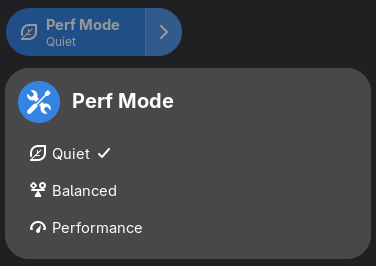

# Perf-Switcher-Asusctl

__Thanks to [chikobara](https://gitlab.com/chikobara) for the original [GPU-Switcher-Supergfxctl](https://github.com/chikobara/GPU-Switcher-Supergfxctl).__

Simple Performance Profile switcher Gnome-Shell-Extension for ASUS laptops using asusctl

Currently tested on OpenSUSE Tumbleweed ( Gnome 49 + Wayland + asusctl v6.2 )

it supports my 3 modes :
Quiet / Balanced / Performance



## Use this only if you

Have a Asus laptop with asusctl installed

## Dependencies

- [asusctl](https://gitlab.com/asus-linux/asusctl)

## Installation

- Install all the dependencies then you can choose manual method or install directly from gnome extension store

### Gnome Extensions Store

- ~~Download the extension from the Store~~ Haven't been added yet

 [](https://extensions.gnome.org/)

### Manual

- clone this repo

    ```bash
    cp -rf Perf-Switcher-Asusctl ~/.local/share/gnome-shell/extensions/perf-switcher-asusctl@rea1-ms
    ```
